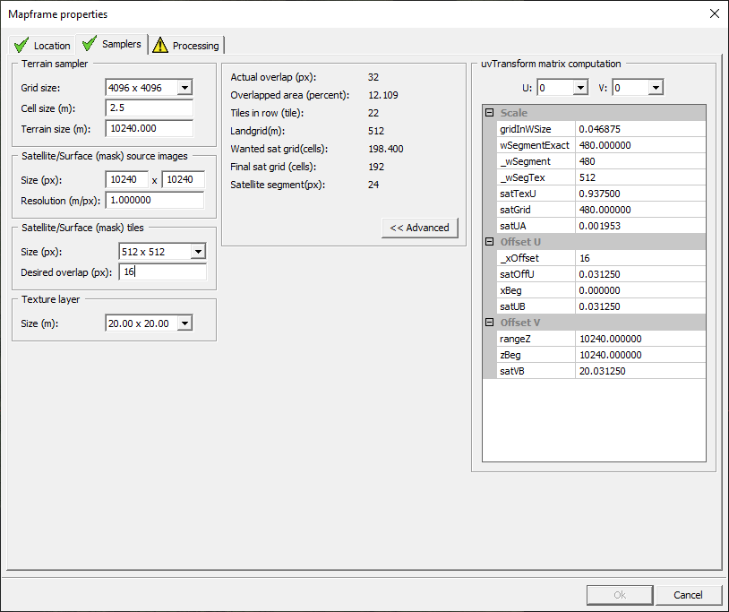
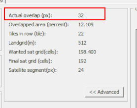
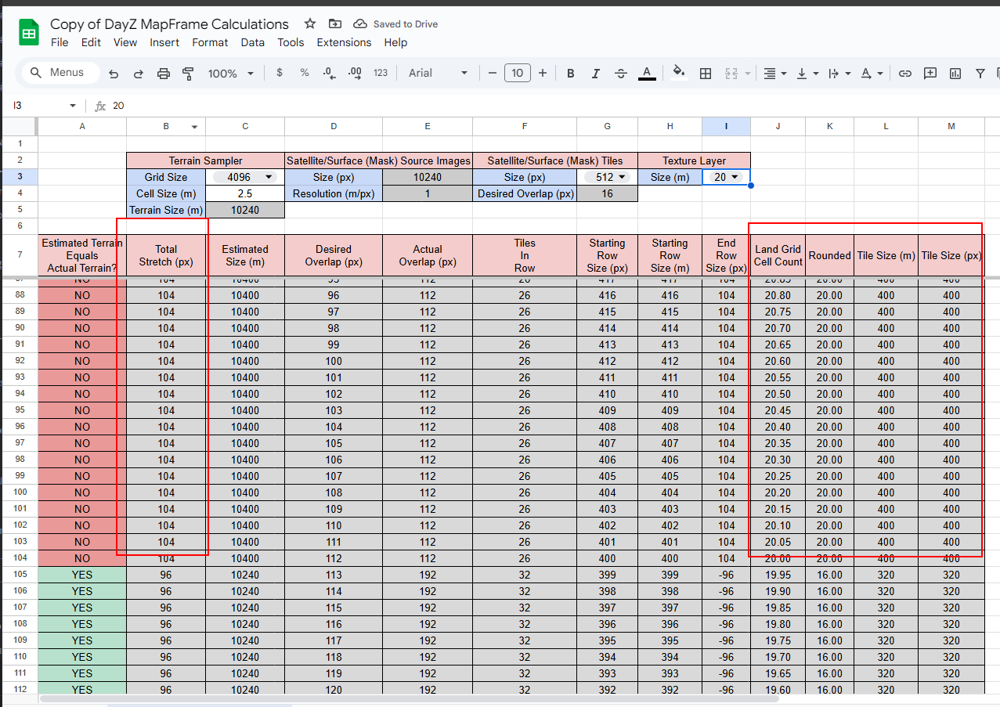
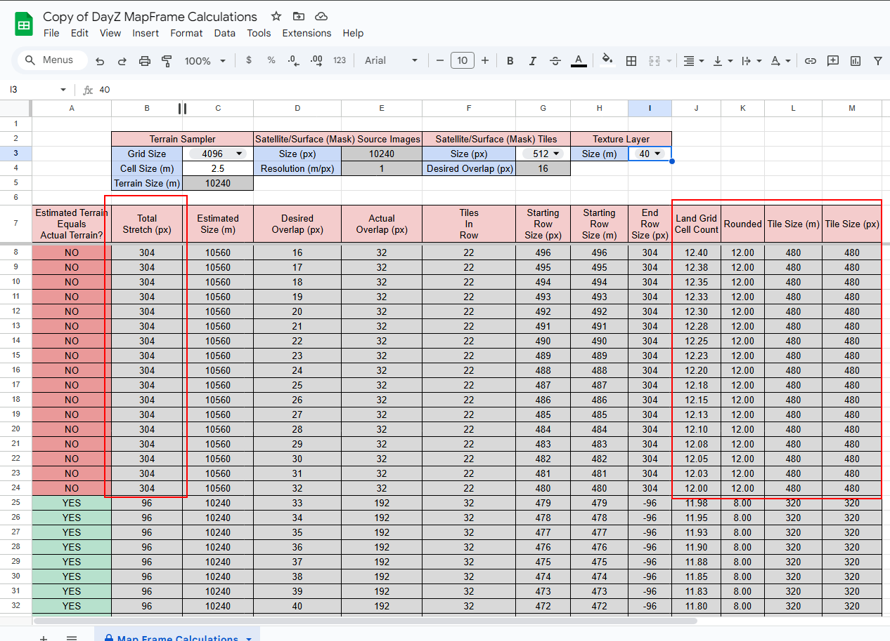

# What Are Good DayZ Map Frame Values?

## Intro

Welcome to the wonderful world of DayZ map making. You like many others are taking your first steps on a long journey that begins with pain and suffering and ends with a sense of accomplishment and progression. The goal of this guide is to help alleviate some of that pain by discussing existing topics and highlight some common pitfalls and roadblocks for new mappers. Let's get started.

## Prerequisites

We could spend hours talking about map making so I will focus mostly on summarizing the excellent [Mapframe Information](https://github.com/pennyworth12345/A3_MMSI/wiki/Mapframe-Information) content provided by `pennyworth12345` and how the Mapframe values relate to one another. If you want to be hands on there are a few prerequisites

- `DayZ` installed
- `DayZ Tools` installed
- Extracted game data into `P:\`
- [Mikero's Tools](https://www.mikero.tools/) - All-in-One Installer downloaded and installed. (Do not install as administrator)
- Heightmap - (Generated by any of your favorite tools; GQIS and L3DT are popular with their respective pro's and con's)
- Satellite Map
- Surface Mask
- Source folder in `P:\` - Use this video to "learn the basics" [Grampz 2 hour map guide](https://www.youtube.com/watch?v=9KgE25NZ0lc)

## Background Information

### The Height Map

One of the first images you will generate for your map is a Height Map. The height map is a way to store 2D color (x,y) information such that it can be computed into 3D height information. Like [Pennyworth](https://github.com/pennyworth12345/A3_MMSI/wiki/Mapframe-Information#cell-size) explains, the 2D image fits into a simple grid with x (`width`) and y (`length`). When we pick any x AND y, trace the coordinates to their location, we find a value. This value represents the "raw" height value before the terrain is built and convert into meters. When you generate a height map you do so at a specific `resolution` (512, 1024, 2048, 4096). This resolution is important because it forces downstream decisions due to its relationship with the other mapframe properties.

### Grid, Cell & Terrain Size

The resolution of your height map is the value you will select for `Grid Size`(px). The reason I stress the importance of the height map resolution is because it is closely linked with the desired cell size. Why? you might ask, Grid size multiplied by cell size is equal to terrain size. Knowing this, cell size effectively sets the terrain size based on a height map, we can make educated performance decisions about the size of a cell.

```
Actual Terrain Size = Grid Size * Cell Size
```

[PMC](https://pmc.editing.wiki/doku.php?id=arma3:terrain:grid-cell-size) has several [tables](https://pmc.editing.wiki/doku.php?id=arma:terrain:grid_cell_size) that incredibly useful for those that do not care to understand the internals.

`Why do we care about the cell size?`

The cell size determines the distance between two height map points. Smaller values creates more `detail` in height maps with variable heights and larger values `smooths` the terrain because there is more distance between each point. [Pennyworth](https://github.com/pennyworth12345/A3_MMSI/wiki/Mapframe-Information#cell-size) shows this in the graph and after seeing this the first reaction is,

`"Well then why don't I use the lowest cell size I can to get the highest detail?"`

We are trying to strike a balance between performance and quality. It makes little sense to have a small cell size on a mostly flat terrain since there is no need to display detail between height map points with little height difference. It also makes no sense to have a mountainous terrain with a large cell size because the detail will be smoothed out over the height difference. The best advice I can give is to experiment with multiple height maps and cell sizes until you find one that `feels` good.

### Satellite and Mask Image Tiling

In order to avoid some of the major roadblocks that can come out of improper mapframe values, we will touch on how [Terrain Builder processes](https://github.com/pennyworth12345/A3_MMSI/wiki/Mapframe-Information#tiling-of-the-satellite-and-mask-images) the massive heightmap/satellite map/mask images into smaller tiles. It is important to study this section of Pennyworth's guide because it outlines exactly the two scenarios map makers find themselves in when constructing their terrains.

#### The "Happy" Path

By this time you have read Pennyworth's guide several times; enough times that you think you understand it. Sleep on it an read it again. Now that you are fully rested and well read we know that there is `no possible way to remove terrain stretching`.

`The observant reader will understand that given a desired overlap and actual overlap of grid cells, the best case scenario will be 'half of the actual overlap' stretched on 'all four sides equally' WHEN the estimated terrain size is the same as your actual terrain size.`

To calculate `Estimated Size` we take the Satellite and Mask Tile Size and subtract the Actial overlap then multiple by the Tiles in Row.

```
Estimated size = (Satellite and Mask Tile Size - Actual Overlap) * Tiles in row
```

```
Universal Stretch = Actual Overlap / 2
```

In this scenario you have chosen "good" (most likely existing) mapframe values that yield `Tiles in Row` which are divisible by 4; we will cover why "4" and how to calculate the required values shortly.

#### The "Hard" Path

In the happy path outlined earlier, the Estimated Terrain Size equaled the Actual Terrain Size (defined by Grid Size \* Cell Size) and all things fell into place magically. What about the times when Estimated Terrain Size is NOT equal to Actual Terrain Size. The majority that end up here either throw up their hands in defeat or turn a blind eye to the egregious stretching and land grid alignment. When we want to experiement and try to choose "new" mapframe values that are not tried and true, it becomes tedious to manually generate terrains to verify the numbers. Most often poor map frame values result in all the standard issues such as stretching terrains, land grids that are missing part of the satellite surface mask, and segemented terrains that look chopped up, etc.



This image shows the Mapframe Properties you can modify to build a terrain. From the information above we know:

**Terrain Sampler**

- `Grid Size`: Height Map resolution
- `Cell Size`: A number that when multiplied by the `Grid Size` is our desired Terrain Size

(In some cases you might know the terrain size you want, Terrain Size / Grid Size will yield a useable Cell Size if you need numbers to start)

- `Terrain Size`: `{Grid Size * Cell Size}`

**Satellite/Surface (Mask) Source Images**

- `Size`: Auto Calculated from resolution
- `Resolution`: Just put 1. You can use larger or smaller values to up/downscale a source image. Not recommended. For advanced users, this is where you can scale sat/surface mask if they are not 1:1 but in most cases they are 1:1

**Satellite/Surface (Mask) Tiles**

- `Size`: The size of a Tile Chunk (px) (128, 256, 512, 1024, 2048)
- `Desired Overlap`: The amount of overlap `you think you want`.

**Texture Layer**

- `Size`: The size of each land grid texture layer. Derived from `Cell Size`. This option has important implications regarding collision and ground texture tiling; more found here [Texture Layer Properties](https://github.com/pennyworth12345/A3_MMSI/wiki/Mapframe-Information#texture-layer-size).

### Calculations

Given our discussion, the only value we cannot fill in right now is the `Desired Overlap`.

Terrain Builders mapframe property selector will calculate the `Actual Overlap` for you, however, this auto calculated value will normally yield stretched or poorly tiled maps. It is up to the map maker to find an ideal overlap to reduce stretching as much as possible.



`So how do we calculate the actual overlap used?`

[Pennyworths Mapframe Property Calculations](https://github.com/pennyworth12345/A3_MMSI/wiki/Mapframe-Information#mapframe-properties-calculations) Lays out the calculations needed for everything. The properties we are most concerned with for actual overlap calculation are below:

- Satellite/Surface (Mask) Tile Size (px)
- Desired Overlap (px)

1. Calculate the offset for the first tile given the map size and desired offset.

```
startTileSizePixels = {Satellite/Surface (Mask) Tile Size (px)} - {Desired Overlap (px)}
```

2. Convert the pixels to meters using sat/surface map resolution

```
startTileSizeMeters = {Resolution} * {startTileSizePixels}
```

3. Calculate the total number of land grid cells.

```
landgridCellCount = {startTileSizeMeters} / {Texture Layer Size}
```

- "Good" values are divisible by 4.

```
// find the remiainder of division by 4 using modulus
remainder = {landgridCellCount} % 4
landgridCellCount = {landgridCellCount} - {remainder}

// one liner
landgridCellCount -= {landgridCellCount} % 4
```

4. Calculate the size of a single tile in meters

```
tileSizeMeters = {landgridCellCount} * {Texture Layer Size}
```

5. Convert meters to pixels using sat/surface map resolution

```
tileSizePixels = {tileSizeMeters} / {Resolution Layer Size}
```

6. Calculate the `Actual Overlap` the tiles will have.

```
Actual Overlap = {Satellite/Surface (Mask) Tile Size (px)} - {tileSizePixels}
```

7. (Optional) Calculate Tiles In Row. Round this number up to the nearest whole number. There cannot be fractions of a tile.

```
Tiles In Row = {Terrain Size} / {tileSizeMeters}
```

### Connecting the Dots

From the above you can see there are only a few properties we have to modify what the `Actual Overlap` will be so lets review what we can do to minimize poor map frame properties.

- Satellite/Surface (Mask) Tile Size (px)
- Resolution
- Texture Layer Size
- Desired Overlap (px)

#### Properties We Cannot Change

- Satellite/Surface (Mask) Tile Size (px): This is the size of our satellite and surface mask. It is tied to a physical image. While you can change this value through image editing for the spirit of this guide we will assume this value is static.

- Resolution: This is based on the scale we expect to use from our satellite and surface mask. Normally is always 1.

#### Properties We Can Change

- Texture Layer Size (m): The size of a land grid texture. Optimzed for 40m. Start at 40 and change desired overlap first before editing texture layer.

- Desired Overlap (px): The desired overlap of a land grid. Lower values are better than higher values. Start at 16 and increase by 1 until `Estimated Terrain Size = Actual Terrain Size`. Using excel or python will help iterate though all the values since your desired overlap should never grow above Tile Size and the Texture Layer Sizes are capped to 8 total possibilities.

### Notable Relationships

I took the liberty of transcribing the calculations into an excel sheet and extrapolated the desired overlap to its maximum. With only Texture Layer remaining as a variable to modify we can see how this value changes the `Tiles In Grid` but not `Actual Overlap` and the only thing that really changes is Total Stretch, Land Grid Cell Count, and Tile Size. This makes sense because when tiling over the Landgrid, the size of texture along with the offset will create larger areas for stretching when overlapping tiles.




