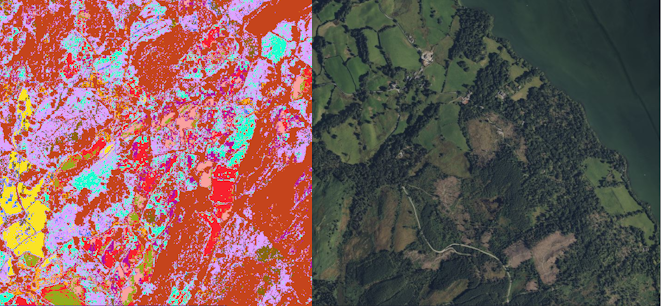
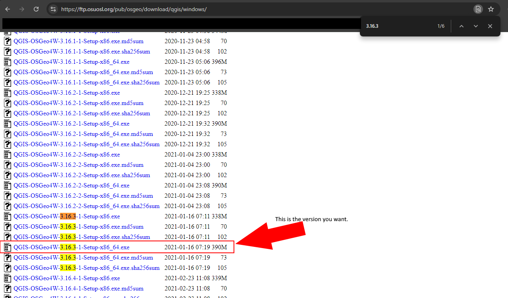
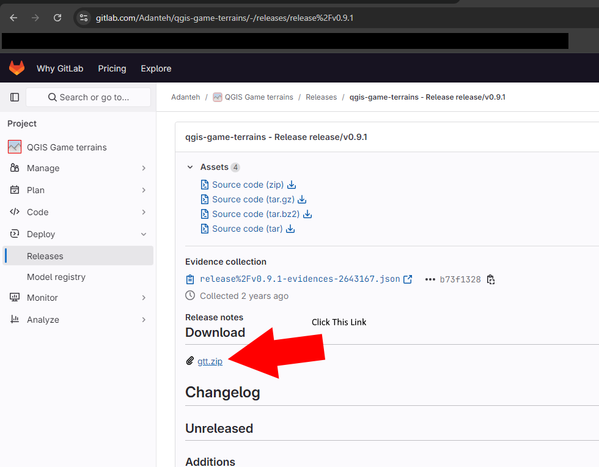
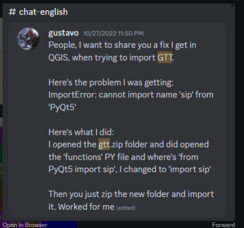
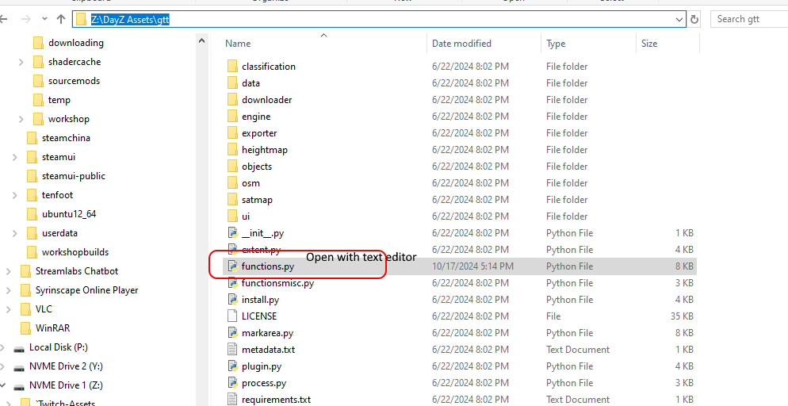
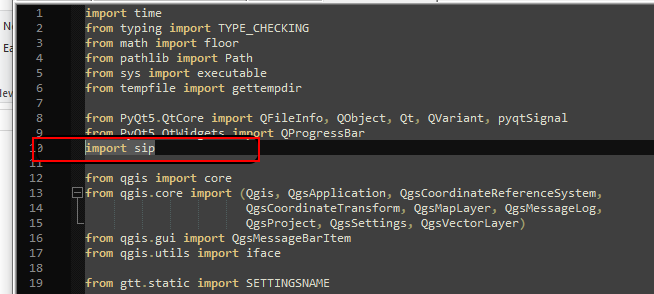
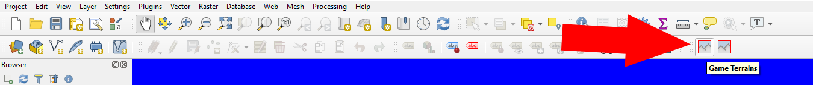
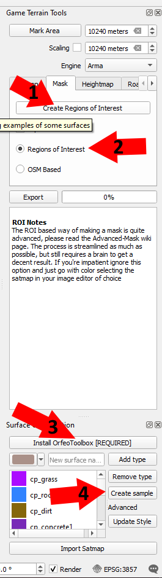
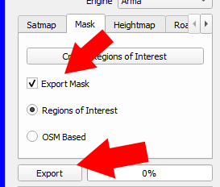
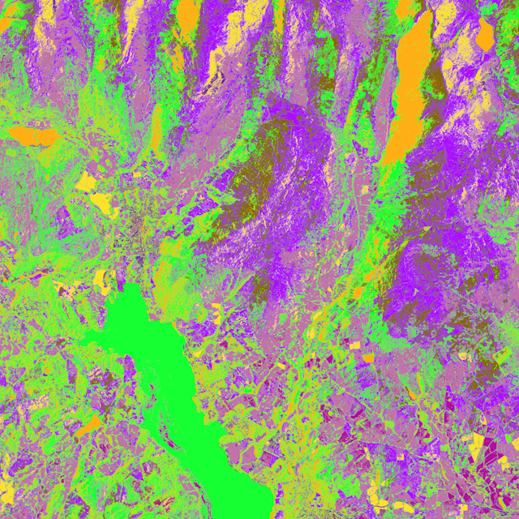

# OTB Mask Generation

## Intro

The Orfeo Toolbox (OTB) plugin within Game Terrain Tools (GTT) allows us to create samples of the satellite map in order to automagically build a surface mask. This is exceptionally helpful in building detailed masks that closely mirror the satellite map without having to manually place pixels or paint an image. It does not account for the maximum 6 surfaces allowed for DayZ so be careful when using more than 6 colors. Once we have this mask, the ability to post processes and fill in detail is possible though the use of sFlora which we will cover.

First there are some prerequisite tools needed to begin.

## PREREQUISITES

### QGIS

QGIS is the main program used to select satellite maps and hosts the plugins that do the majority of the processing. Refer to one of Gramps (DZ Academy) for basics on how to use QGIS. Installing this tool is as simple as downloading the exe and double clicking.

**QGIS:**
https://ftp.osuosl.org/pub/osgeo/download/qgis/windows/

### Game Terrain Tools

Game Terrain Tools (GTT) is a plugin that allows users to export satellite maps and other interesting features of an area. This plugin will be where most of our activities will be held.

**GTT:**
https://gitlab.com/Adanteh/qgis-game-terrains/-/releases/release%2Fv0.9.1

#### GTT Python Fix

Over time python has been updated but these specific versions have not. If you get an error while trying to import the GTT addon, follow the steps below the fix your zip folder.

Unzip the plugin contents into a folder so you can browse its contents. Find the specified file to edit.

Editing the file; remove `from PyQt5` so only `import sip` remains. Re-zip the folder using `gtt.zip` as the name. (Rename the original if you need)

### Orfeo Toolbox (OTB)

**OTB:**
https://www.orfeo-toolbox.org/packages/archives/OTB/OTB-7.2.0-Win64.zip

Download this zip and place it somewhere memorable.

## Getting Started

When you install the GTT plugin (Plugins -> Add Plugin -> Pick the zip file) two new buttons will appear in your QGIS window. Clicking the `Game Terrain` button will bring up the window for the Game Terrain Tools

The tools window has several options that are useful for this activity.

1. `Create Regions of Interest`: Brings up the advanced options to create custom regions.
2. `Regions of Interest`: Toggle for export. Use this to generate your custom mask instead of using OSM details.
3. `Install OrfeoToolbox [REQUIRED]`: Button to install OTB tools. Only needs to be clicked once. If it asks for a folder, choose the OTB-7.2.0.zip file you downloaded earlier.
4. `Create Sample`: From a selected type, creates polygon shapes for the generator to sample for a given surface.

After creating a few samples, select `Export Mask` and then `Export` to begin the generation process.

**Depending on map size, samples, your computer specs, etc this export can take a long time so be patient and make sure you are not doing anything else to hog CPU. This will max out your pc.**

Eventually you will see the terminal close and in your source folder a new mask image that is very detailed for follow on processing.

