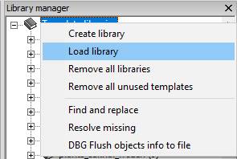

# Template Library Generator

When starting map making, a common first step is importing map assets into the `Template Library`. In most tutorials the advice is to crawl your `P:/dz` directories and import one by one. I felt this process was labor intensive given we have import options available and fosters the mentality of not updating the libraries often. In order to streamline Template Library updates, there needed to be a way to generate a common format without much labor.

This tool aims to remove the human element for creating Template Libraries and allow for quick updating existing auto generated libraries by using copy and paste.


## How To Use (EASY VERSION)

- Step 1: Download the auto generated files here [https://github.com/Treee/DayZDocs/tree/main/TemplateLibraryGenerator/output](https://github.com/Treee/DayZDocs/tree/main/TemplateLibraryGenerator/output)

- Step 2: Place these files inside your `TemplateLibrary` folder within the source of your `Terrain Builder` project. Take note, `Terrain Builder` does not like duplicate values so if you have existing `.tml` files ensure no duplicate names are present.


- Step 3: Load the libraries into `Terrain Builder` so they are available for object placement.



You now have all vanilla map assets with reasonable categories.

## How To Use (MANUAL VERSION)

- Step 1: Clone the repository

- Step 2: Navigate to the root directory

- Step 3: Open a terminal and enter the command `npm start`

- Step 4: Copy the template files into the `TemplateLibrary` folder within the source of your `Terrain Builder` project.

- Step 3: Load the libraries into `Terrain Builder` so they are available for object placement.

## Special Considerations

At the time of writing this `dz\water_sakhal\ice_sea\ Ice_Sea_Square_50m.p3d` has a bug regarding the filename which is having an eroneous space prefixing the name. Eventually this will be fixed and running the tool/renaming the template name/p3d path will fix any messages `Terrain Builder` shows when loading a project.

### (Optional) Data Tweaking

#### getp3dsForImport.js Notes

This file is fairly basic and the bulk of code is file i/o. The important items to call out are:

- `foldersToTemplate` - Array of folders the crawler will consider important.
- `readdirRecursiveSync` - Function that takes a root filePath and folder and crawls for p3ds.
- `writeFileSync` - Writes the payload to a file for subsequent parsing.

```js
const foldersToTemplate = ["plants", "plants_bliss", "plants_sakhal", "rocks", "rocks_bliss", "rocks_sakhal", "structures", "structures_bliss", "structures_sakhal", "water", "water_bliss", "water_sakhal"];

foldersToTemplate.forEach((folder) => {
  readdirRecursiveSync("P:\\dz", folder);
});

writeFileSync("./test/rawTemplateLibraryData.json", JSON.stringify(foldersFound), "utf8");
```

It is untested but there is no reason this would not work for P drive as the root and folders other than vanilla.

#### parseP3dsToTemplateLibrary.js Notes

This file contains the logic to parse raw data and format into `TemplateLibrary (.tml)` files. I have broken out the main steps into functions as you can see below.

- Import raw data from file. We generated this file from `getp3dsForImport.js`
- Format the raw data into an object that can be iterated over easily.
- Write the formatted data to their respective Template files.

```js
const jsonData = parseP3dsForImport(path.join("./test", "rawTemplateLibraryData.json"));

const templateLibraryData = formatP3dJsonForTemplateLibrary(jsonData);

writeTemplateLibraryOutput(templateLibraryData);
```

I have encoded a few assumptions that might not be applicable to everyone so below I will outline my thinking.

```js
function formatP3dJsonForTemplateLibrary(data) {
  /* This is the main data object returned. Template Names for the key and the value is list of p3ds to include within the template. There are two types of Category for a template I consider notable:

  a. Root Category - This is defined by having a config.cpp present within a directory. It tells me that definitions exist for p3ds in this folder or sub folders. Either way, a good identifier for template names. In practice, folders like dz/plants/clutter and dz/plants/bush have their own configs which allow for nice groupings for templates instead of putting all objects within dz/plants.
  b. Sub Category - This is defined by being a child of the root. (1 level within the directory). This value can be changed to crawl deeper and create MORE folders for templates inside isWithinDepthLimits. I felt 1 level was reasonable given, between DZ/Bliss/Sakhal, there are already 183 categories and the majority of those residue within "structures".

    Case 1:
    Root Category has no p3ds within its folder (ex: dz/plants)
    Sub Categories exist (any number), has p3ds (ex: dz/plants/bush, dz/plants/clutter, dz/plants/tree & cutted)

    Case 2:
    Root Category has p3ds within its folder (ex: dz/rocks)
    No Sub Categories exist

    Case 3:
    Root Category has p3ds within its folder (ex: dz/structures/furniture/bathroom)
    Sub Categories exist (any number), has p3ds (ex: dz/structures/furniture/bathroom/basin...)

    Edge Case:
    Short Circuit: No P3D's exist & not config.cpp


    For each raw key (template name),
    Group "like" p3ds together using the children directories of Root/Sub Categories
    */
  const templateLibraryData = {};
  let lastKey = Object.keys(data)[0];
  let numRootParts = 0;
  let templateName = "";
  let associatedP3Ds = [];

  Object.keys(data).forEach((key) => {
    const payload = data[key];
    // root level category
    if (payload.configcpp !== "") {
      numRootParts = key.split("\\").length;
      lastKey = key;
      // reset associated p3ds when new categories are found
      associatedP3Ds = [];
    }
    // check 1 level deep directories
    if (isWithinDepthLimits(key, numRootParts + 1)) {
      lastKey = key;
      // reset associated p3ds when new categories are found
      associatedP3Ds = [];
    }
    // blindly make a new template name from the key
    templateName = formatFilePathToTemplateName(key);
    // if the current key has traces of last key inside
    if (key.indexOf(lastKey) > -1) {
      // use the last key as our template name (nesting folders)
      templateName = formatFilePathToTemplateName(lastKey);
    }
    // if our helper object has this key AND items
    if (templateLibraryData[templateName] && templateLibraryData[templateName].length > 0) {
      // append
      templateLibraryData[templateName] = [...templateLibraryData[templateName], ...payload.p3ds];
    } else {
      // define
      templateLibraryData[templateName] = payload.p3ds;
    }
  });

  return templateLibraryData;
}
```
